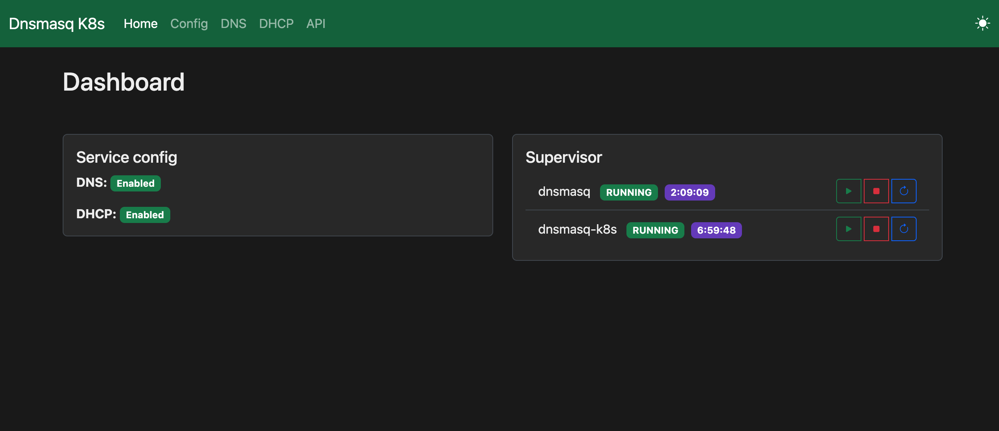
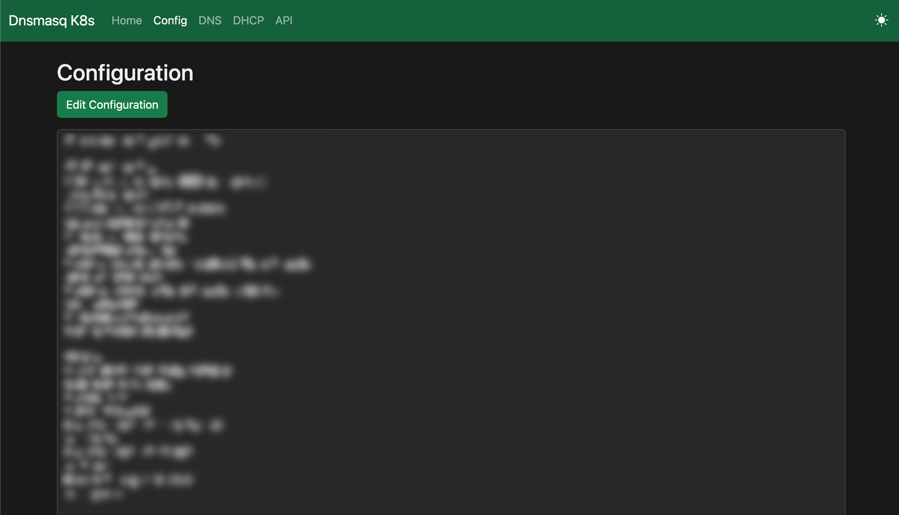
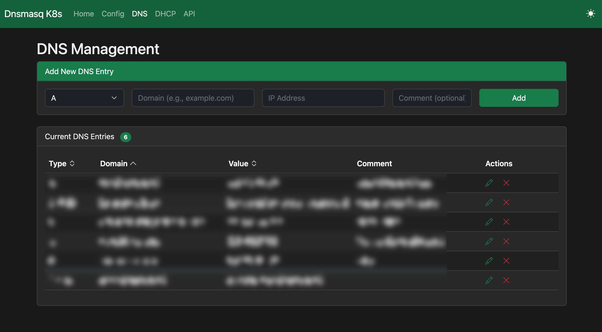
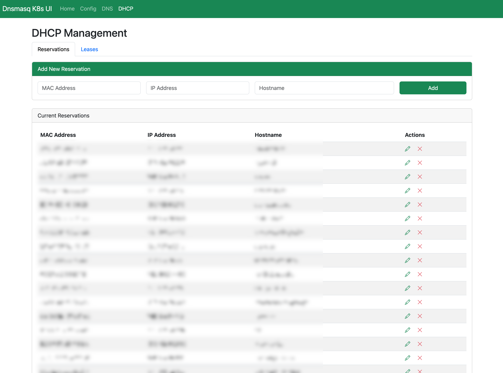
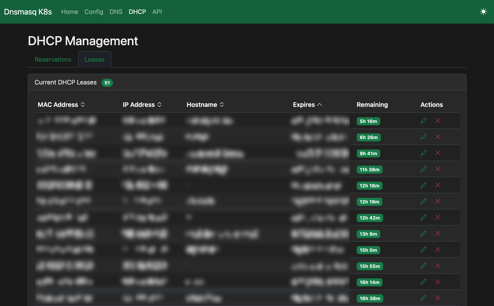
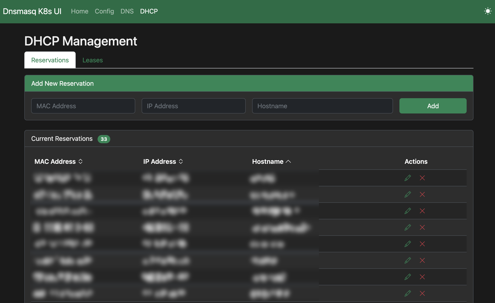

# Dnsmasq K8s UI [](https://artifacthub.io/packages/search?repo=dnsmasq-k8s-ui)

A modern, lightweight web interface for managing **dnsmasq** DNS and DHCP services in Kubernetes clusters. Simplify your network management with an intuitive UI for DNS records, DHCP leases, and service configuration. Ideal for DNS & DHCP home labs.













## ✨ Features

- DNS records stored in Kubernetes ConfigMap: `dnsmasq-custom-dns`
- DHCP reservations stored in ConfigMap: `dnsmasq-reservations`
- DHCP leases stored in ConfigMap: `dnsmasq-leases`
- Configuration changes persisted automatically
- Configs/Leases/Reservations can be edited directly in the UI or in Kubernetes and stay synced

### 🎯 Dashboard
- Easy management of DNS, DHCP, and Supervisor services
- Quick service status overview
- Dark/Light theme toggle

### 🌐 DNS Management
- **A Records**: Add, edit, and delete DNS A records with IP validation
- **CNAME Records**: Manage domain aliases with automatic validation
- **TXT Records**: Configure SPF, DKIM, and other text records
- Sortable table with search capabilities
- Live view of all DNS entries from `/etc/dnsmasq.d/custom.conf`

### 📡 DHCP Management
- **Static Reservations**: Reserve IP addresses for specific MAC addresses
- **Active Leases**: View all current DHCP leases with expiration times
- **Lease Details**: Hostname, IP, MAC address, and remaining lease time
- Create reservations directly from active leases
- Sortable tables for easy navigation

### ⚙️ Configuration Editor
- **View Mode**: Read-only configuration display (default)
- **Edit Mode**: Direct editing of `/etc/dnsmasq.conf`
- **Pre-loaded Templates**: Quick start with recommended configurations
- Syntax validation before saving

### 🎛️ Service Control
- Start, stop, and restart dnsmasq services from the UI
- Supervisor integration for process management

---

## 📦 Installation

### Prerequisites

- **Kubernetes**: v1.19 or higher
- **Helm**: v3.0 or higher
- **kubectl**: Configured to access your cluster

### Quick Start with Helm

1. **Install using Helm**:
   You can find the Helm chart page [here](https://artifacthub.io/packages/helm/dnsmasq-k8s-ui/dnsmasq-k8s-ui):

   ```bash
   helm repo add dnsmasq-k8s-ui https://deimosfr.github.io/dnsmasq-k8s-ui/
   helm install my-dnsmasq-k8s-ui dnsmasq-k8s-ui/dnsmasq-k8s-ui --version 1.1.0
   ```

2. **Verify the installation**:
   ```bash
   kubectl get pods -l app=dnsmas-k8s-ui
   ```

### Custom Installation

Create a `values.yaml` file to customize your deployment:

```yaml
replicaCount: 1

image:
  repository: deimosfr/dnsmasq-k8s-ui
  pullPolicy: IfNotPresent
  tag: "1.2.0"

hostNetwork: true

service:
  type: LoadBalancer
  port: 80

dns:
  enabled: true

dhcp:
  enabled: true
  leaseFile: /var/lib/misc/dnsmasq.leases

serviceAccount:
  # Specifies whether a service account should be created
  create: true
  # Annotations to add to the service account
  annotations: {}
  # The name of the service account to use.
  # If not set and create is true, a name is generated using the fullname template
  name: ""

securityContext:
  capabilities:
    add:
      - NET_ADMIN
```

Install with custom values:
```bash
helm install dnsmas-k8s-ui ./chart -f values.yaml
```

### Upgrade

```bash
helm upgrade dnsmas-k8s-ui ./chart
```

### Uninstall

```bash
helm uninstall dnsmas-k8s-ui
```

---

## 🚀 Usage

### Accessing the UI

**Using Port Forward (for testing):**
```bash
kubectl port-forward svc/dnsmasq-k8s-ui 8080:80
```
Then open: http://localhost:8080

---

## 🛠️ Development

### Updating Versions

To update the application version across all files (`version.go`, `Chart.yaml`, `values.yaml`, `README.md`), edit `backend/src/api/version.go` and run:

```bash
go generate ./backend/src/api/version.go
```
